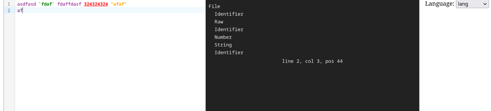

# CodeMirror Language Bootstrap

This is a minimal environment for bootstrapping new language support
for CodeMirror editor.

The language is defined in `src/lang/lang.grammar` in [Lezer](https://lezer.codemirror.net/).

To get started, run `npm run dev` after `npm i`.

